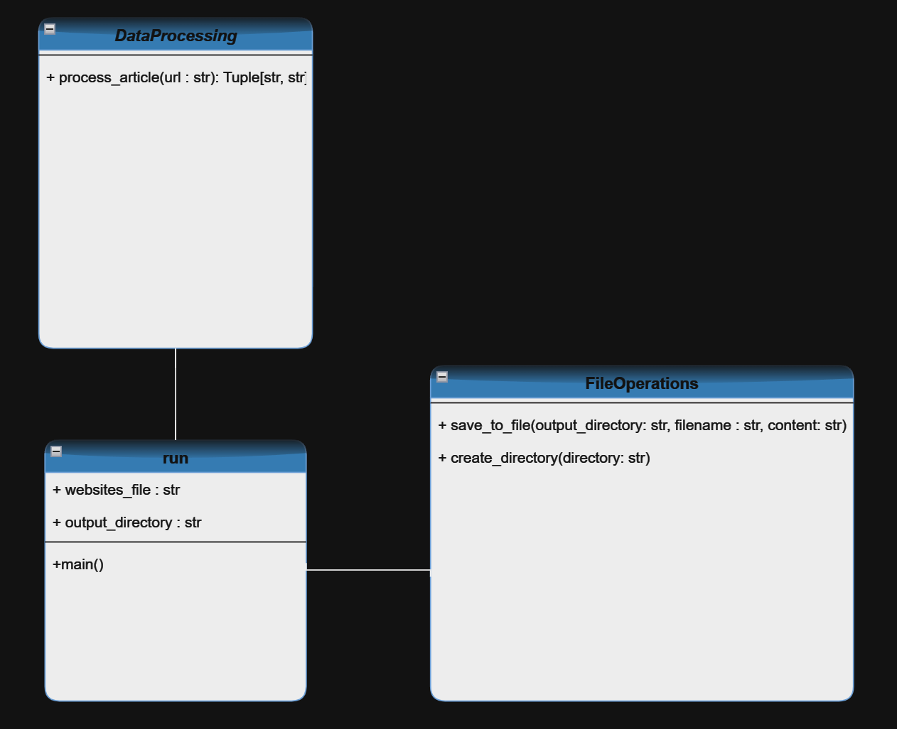

# Project-2: Data Processing and File Operations

## Table of Contents

- [Project-2: Data Processing and File Operations](#project-2-data-processing-and-file-operations)
    - [Project Description](#project-description)
    - [Folder Structure](#folder-structure)
    - [Modules](#modules)
        - [module_1/data_processing.py](#module_1data_processingpy)
        - [module_2/file_operations.py](#module_2file_operationspy)
    - [SOLID Principle](#solid-principle)
    - [Class Diagram](#class-diagram)
        - [run and DataProcessing](#run-and-dataprocessing)
        - [run and FileOperations](#run-and-fileoperations)
        - [DataProcessing and FileOperations](#dataprocessing-and-fileoperations)
        - [In Summary](#in-summary) 
    - [Usage](#usage)

## Project Description

Project-2 aims to refactor and enhance the functionality of Project-1 by breaking down the code into two logical modules, implementing a folder structure, and incorporating SOLID principles. The project involves the following tasks:

1. **Code Refactoring:**
   - Break down Project-1 code into two logically different modules.
   - Use `import` to call the functionality of one file into another.

2. **Folder Structure:**
   - Utilize the given folder structure.
   - Create a `Data/raw` folder to store unprocessed/raw data files.
   - Create a `Data/processed` folder to store processed articles.

3. **Main Program:**
   - Implement a `run.py` file containing the main function.
   - Call the rest of the modules from the main program.

4. **Documentation:**
   - Document code with comments in each Python file explaining input, output, and functionality.
   - Use comments to describe the working of the code.

5. **SOLID Principles:**
   - Implement one of the SOLID principles (Single Responsibility Principle, Open/Closed Principle, Liskov Substitution Principle, Interface Segregation Principle, Dependency Inversion Principle).
   - Mention the SOLID principle used and its benefits at the top of the relevant Python file.

6. **Class Diagram:**
   - Create a UML class diagram of the entire software.
   - Save the class diagram as a JPEG/PNG and upload it to GitHub.

## Folder Structure

The project adheres to the following folder structure:


## Modules

### `module_1/data_processing.py`

This module processes raw article data from a given URL.

- **Functions/Classes:**
  - `process_article(url: str) -> Tuple[str, str]`: Processes the article and returns the headline and body.

...

### `module_2/file_operations.py`

This module handles file-related operations.

- **Functions/Classes:**
  - `save_to_file(output_directory: str, filename: str, content: str) -> None`: Saves content to a file.
  - `create_directory(directory: str) -> None`: Creates a directory if it doesn't exist.

...

## SOLID Principle

This project adheres to the Single Responsibility Principle (SOLID).

- **SOLID Principle:**
  - Single Responsibility Principle (SRP)

- **Benefits:**
  - Enhances maintainability by ensuring that each module has only one reason to change.

## Class Diagram


### run and DataProcessing:

- `run` imports and uses the `process_article` function from `DataProcessing`.
- **Relationship:** Association

### run and FileOperations:

- `run` imports and uses the `save_to_file` and `create_directory` functions from `FileOperations`.
- **Relationship:** Association

### DataProcessing and FileOperations:

- There is no direct interaction between `DataProcessing` and `FileOperations`. They operate independently, and their functionalities do not directly depend on each other.

### In Summary:

- `run` has an association relationship with both `DataProcessing` and `FileOperations`.
- There is no direct relationship between `DataProcessing` and `FileOperations`.

## Usage

- Make sure to use the `requirement.yaml` provided to create a new environment:
  ```bash
  conda env create -f requirement.yaml
  conda activate new_env_name
  python run.py
